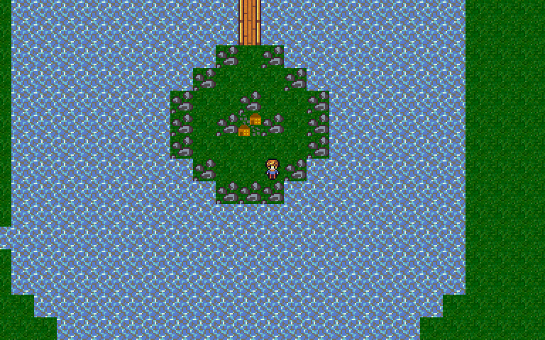

# The Narthenian Conspiracy

When the heavens and the underworld made a joint attack on the people of the earth, the six cities united under the leadership of Carathusia for defense. Narthenus, one of the greatest warriors of the Forest People, disapproved of his people’s decision to submit to Carathusia, and betrayed both his army and the joint army’s battle plans to the underworld. The traitor’s actions nearly brought an end to the world, but under the Carthusian general’s leadership, the six cities managed to save the mortal races.

The unified kingdom lasted for centuries, until four thousand years after the great war, when a cult calling themselves the Narthenians attempted to overthrow the kingdom and break up the rule of the people once again. Civil war lasted for many years until the cult was finally driven out, but not destroyed. The leader of the cult, Tarpeya, fled to the deserts in the north with her few remaining followers. Rumors from the desert city Erimea suggest that the cult has established camp in the western part of the desert.

Although Carathusia’s resources were nearly exhausted after the civil war, the king was troubled by the reported movements of the remaining Narthenians. Concerned that Tarpeya was up to something more than just hiding out, he summoned a young warrior who had distinguished himself in service during the civil war. The young hero was sent to investigate and advised to travel first to Adon, where the dungeon held a former adviser to Tarpeya who may know more about her activities.

## Compiling and Running

The Narthenian Conspiracy uses CMake. At the moment, the partially written game has not been tested on any platform besides FreeBSD. I hope to provide more complete build instructions soon, once the game is a little more feature complete and has been tested on Windows and GNU/Linux.

Currently arrow keys move the player, and ENTER and SPACE act as the action keys. Gamepad support coming soon. Use ESC to quit at any time.

## Credits

Story and programming by Jeremiah Stoddard

Tile artwork based on the Tiny16 tileset by Lanea Zimmerman, available on OpenClipArt.org and itch.io, with some edits and additional tiles by Jeremiah Stoddard.  Monster and combat background graphics by Jeremiah Stoddard, using AI slop as a foundation.

Sound effects by Jeremiah Stoddard. They were originally written in BASIC using QB64 Phoenix Edition, and recorded with Audacity.

## License

This program is free software: you can redistribute it and/or modify it under the terms of the GNU General Public License as published by the Free Software Foundation, either version 3 of the License, or (at your option) any later version.

This program is distributed in the hope that it will be useful, but WITHOUT ANY WARRANTY; without even the implied warranty of MERCHANTABILITY or FITNESS FOR A PARTICULAR PURPOSE. See the GNU General Public License for more details.

You should have received a copy of the GNU General Public License along with this program. If not, see <https://www.gnu.org/licenses/>. 

## Contact Information

The author can be contacted at jstoddard at sdf dot org. Additional contact information is available on his webpage at http://jeremiahstoddard.com/.
